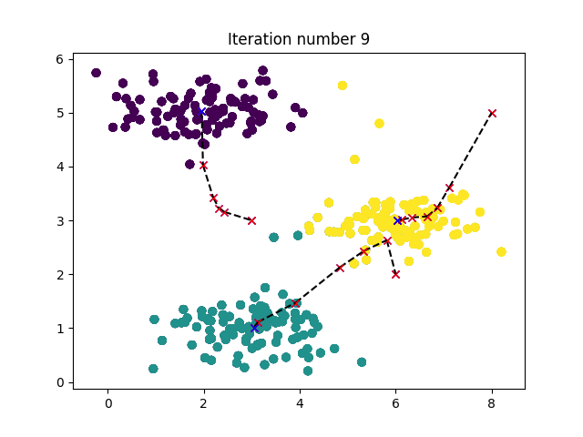
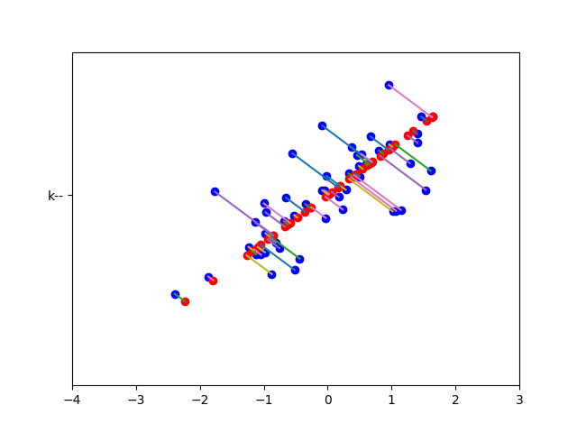

这周是无监督学习算法,比较简单.`k means`之前就已经写过了,`PCA`主要是有个矩阵的奇异值分解需要看看矩阵相关知识.


<!--more-->

# ex7.py


```python
from numpy.core import *
from scipy.io import loadmat
from imageio import imread
from sklearn import svm
import matplotlib.pyplot as plt
from fucs7 import findClosestCentroids, computeCentroids, runkMeans,\
    kMeansInitCentroids
if __name__ == "__main__":
    # Machine Learning Online Class
    #  Exercise 7 | Principle Component Analysis and K-Means Clustering
    #
    #  Instructions
    #  ------------
    #
    #  This file contains code that helps you get started on the
    #  exercise. You will need to complete the following functions:
    #
    #     pca.m
    #     projectData.m
    #     recoverData.m
    #     computeCentroids.m
    #     findClosestCentroids.m
    #     kMeansInitCentroids.m
    #
    #  For this exercise, you will not need to change any code in this file,
    #  or any other files other than those mentioned above.
    #

    # Initialization

    # ================= Part 1: Find Closest Centroids ====================
    #  To help you implement K-Means, we have divided the learning algorithm
    #  into two functions -- findClosestCentroids and computeCentroids. In this
    #  part, you shoudl complete the code in the findClosestCentroids function.
    #
    print('Finding closest centroids.')

    # Load an example dataset that we will be using
    data = loadmat('ex7data2.mat')
    X = data['X']  # [300,2]

    # Select an initial set of centroids
    K = 3  # 3 Centroids
    initial_centroids = array([
        [3., 3.],
        [6., 2.],
        [8., 5.]])

    # Find the closest centroids for the examples using the
    # initial_centroids
    idx = findClosestCentroids(X, initial_centroids)

    print('Closest centroids for the first 3 examples: ')
    print(idx[0: 3])
    print('\n(the closest centroids should be 0, 2, 1 respectively)')

    print('Program paused. Press enter to continue.')

    # ===================== Part 2: Compute Means =========================
    #  After implementing the closest centroids function, you should now
    #  complete the computeCentroids function.
    #
    print('\nComputing centroids means.')

    #  Compute means based on the closest centroids found in the previous part.
    centroids = computeCentroids(X, idx, K)

    print('Centroids computed after initial finding of closest centroids: ')
    print(centroids)
    print('\n(the centroids should be')
    print('   [ 2.428301 3.157924 ]')
    print('   [ 5.813503 2.633656 ]')
    print('   [ 7.119387 3.616684 ]')

    print('Program paused. Press enter to continue.')

    # =================== Part 3: K-Means Clustering ======================
    #  After you have completed the two functions computeCentroids and
    #  findClosestCentroids, you have all the necessary pieces to run the
    #  kMeans algorithm. In this part, you will run the K-Means algorithm on
    #  the example dataset we have provided.
    #
    print('\nRunning K-Means clustering on example dataset.')

    # Load an example dataset
    data = loadmat('ex7data2.mat')
    X = data['X']
    # Settings for running K-Means
    K = 3
    max_iters = 10

    # For consistency, here we set centroids to specific values
    # but in practice you want to generate them automatically, such as by
    # settings them to be random examples (as can be seen in
    # kMeansInitCentroids).
    initial_centroids = array(
        [[3., 3.],
         [6., 2.],
         [8., 5.]])

    # Run K-Means algorithm. The 'true' at the end tells our function to plot
    # the progress of K-Means
    centroids, idx = runkMeans(X, initial_centroids, max_iters, True)
    print('\nK-Means Done.')

    print('Program paused. Press enter to continue.')

    # ============= Part 4: K-Means Clustering on Pixels ===============
    #  In this exercise, you will use K-Means to compress an image. To do this,
    #  you will first run K-Means on the colors of the pixels in the image and
    #  then you will map each pixel on to it's closest centroid.
    #
    #  You should now complete the code in kMeansInitCentroids.m
    #

    print('\nRunning K-Means clustering on pixels from an image.')

    #  Load an image of a bird
    A = double(imread('bird_small.png'))

    # If imread does not work for you, you can try instead
    #   load ('bird_small.mat');

    A = A / 255  # Divide by 255 so that all values are in the range 0 - 1

    # Size of the image
    img_size = shape(A)

    # Reshape the image into an Nx3 matrix where N = number of pixels.
    # Each row will contain the Red, Green and Blue pixel values
    # This gives us our dataset matrix X that we will use K-Means on.
    X = reshape(A, (img_size[0] * img_size[1], 3))

    # Run your K-Means algorithm on this data
    # You should try different values of K and max_iters here
    K = 16
    max_iters = 10

    # When using K-Means, it is important the initialize the centroids
    # randomly.
    # You should complete the code in kMeansInitCentroids.m before proceeding
    initial_centroids = kMeansInitCentroids(X, K)

    # Run K-Means
    [centroids, idx] = runkMeans(X, initial_centroids, max_iters)

    print('Program paused. Press enter to continue.')

    # ================= Part 5: Image Compression ======================
    #  In this part of the exercise, you will use the clusters of K-Means to
    #  compress an image. To do this, we first find the closest clusters for
    #  each example. After that, we

    print('\nApplying K-Means to compress an image.')

    # Find closest cluster members
    idx = findClosestCentroids(X, centroids)

    # Essentially, now we have represented the image X as in terms of the
    # indices in idx.

    # We can now recover the image from the indices (idx) by mapping each pixel
    # (specified by it's index in idx) to the centroid value
    X_recovered = centroids[idx, :]

    # Reshape the recovered image into proper dimensions
    X_recovered = reshape(X_recovered, (img_size[0], img_size[0], 3))

    # Display the original image
    plt.figure()
    plt.subplot(1, 2, 1)
    plt.imshow(A)
    plt.title('Original')

    # Display compressed image side by side
    plt.subplot(1, 2, 2)
    plt.imshow(X_recovered)
    plt.title('Compressed, with {} colors.'.format(K))

    print('Program paused. Press enter to continue.')
    plt.show()

```

## 效果

```sh
Finding closest centroids.
Closest centroids for the first 3 examples:
[0 2 1]

(the closest centroids should be 0, 2, 1 respectively)
Program paused. Press enter to continue.

Computing centroids means.
Centroids computed after initial finding of closest centroids:
[[2.42830111 3.15792418]
 [5.81350331 2.63365645]
 [7.11938687 3.6166844 ]]

(the centroids should be
   [ 2.428301 3.157924 ]
   [ 5.813503 2.633656 ]
   [ 7.119387 3.616684 ]
Program paused. Press enter to continue.

Running K-Means clustering on example dataset.
K-Means iteration 0/10...

K-Means iteration 1/10...

K-Means iteration 2/10...

K-Means iteration 3/10...

K-Means iteration 4/10...

K-Means iteration 5/10...

K-Means iteration 6/10...

K-Means iteration 7/10...

K-Means iteration 8/10...

K-Means iteration 9/10...


K-Means Done.
Program paused. Press enter to continue.

Running K-Means clustering on pixels from an image.
K-Means iteration 0/10...

K-Means iteration 1/10...

K-Means iteration 2/10...

K-Means iteration 3/10...

K-Means iteration 4/10...

K-Means iteration 5/10...

K-Means iteration 6/10...

K-Means iteration 7/10...

K-Means iteration 8/10...

K-Means iteration 9/10...

Program paused. Press enter to continue.

Applying K-Means to compress an image.
Program paused. Press enter to continue.

```




# ex7_pca.py


```python
from numpy.core import *
from numpy.random import rand, randint
from scipy.io import loadmat
from sklearn import svm
from imageio import imread
import matplotlib.pyplot as plt
from mpl_toolkits.mplot3d import Axes3D
from fucs7 import featureNormalize, pca, drawline, projectData, recoverData,\
    displayData, runkMeans, kMeansInitCentroids, plotDataPoints

if __name__ == "__main__":
    # Machine Learning Online Class
    #  Exercise 7 | Principle Component Analysis and K-Means Clustering
    #
    #  Instructions
    #  ------------
    #
    #  This file contains code that helps you get started on the
    #  exercise. You will need to complete the following functions:
    #
    #     pca.m
    #     projectData.m
    #     recoverData.m
    #     computeCentroids.m
    #     findClosestCentroids.m
    #     kMeansInitCentroids.m
    #
    #  For this exercise, you will not need to change any code in this file,
    #  or any other files other than those mentioned above.
    #

    # ================== Part 1: Load Example Dataset  ===================
    #  We start this exercise by using a small dataset that is easily to
    #  visualize
    #
    print('Visualizing example dataset for PCA.\n\n')

    #  The following command loads the dataset. You should now have the
    #  variable X in your environment
    data = loadmat('ex7data1.mat')
    X = data['X']
    #  Visualize the example dataset
    plt.figure()
    plt.plot(X[:, 0], X[:, 1], 'bo')
    plt.axis([0.5, 6.5, 2, 8])
    # axis square

    print('Program paused. Press enter to continue.\n')
    # pause

    # =============== Part 2: Principal Component Analysis ===============
    #  You should now implement PCA, a dimension reduction technique. You
    #  should complete the code in pca.m
    #
    print('\nRunning PCA on example dataset.\n\n')

    #  Before running PCA, it is important to first normalize X
    X_norm, mu, sigma = featureNormalize(X)

    #  Run PCA
    U, S = pca(X_norm)

    #  Compute mu, the mean of the each feature

    #  Draw the eigenvectors centered at mean of data. These lines show the
    #  directions of maximum variations in the dataset.
    drawline(mu, mu + 1.5 * S[0, 0]*U[:, 0], 'k-')
    drawline(mu, mu + 1.5 * S[1, 1]*U[:, 1], 'k-')

    print('Top eigenvector: \n')
    print(' U[:,0] = {} {} \n'.format(U[0, 0], U[1, 0]))
    print('\n(you should expect to see -0.707107 -0.707107)\n')

    print('Program paused. Press enter to continue.\n')

    # =================== Part 3: Dimension Reduction ===================
    #  You should now implement the projection step to map the data onto the
    #  first k eigenvectors. The code will then plot the data in this reduced
    #  dimensional space.  This will show you what the data looks like when
    #  using only the corresponding eigenvectors to reconstruct it.
    #
    #  You should complete the code in projectData.m
    #
    print('\nDimension reduction on example dataset.\n\n')

    #  Plot the normalized dataset (returned from pca)
    plt.figure()
    plt.plot(X_norm[:, 0], X_norm[:, 1], 'bo')
    plt.axis([-4, 3, - 4, 3])

    #  Project the data onto K = 1 dimension
    K = 1
    Z = projectData(X_norm, U, K)
    print('Projection of the first example: {}\n'.format(Z[1]))
    print('\n(this value should be about 1.481274)\n\n')

    X_rec = recoverData(Z, U, K)
    print('Approximation of the first example: {} {}\n'.format(
          X_rec[0, 0], X_rec[0, 1]))
    print('\n(this value should be about  -1.047419 -1.047419)\n\n')

    #  Draw lines connecting the projected points to the original points
    plt.plot(X_rec[:, 0], X_rec[:, 1], 'ro')
    for i in range(size(X_norm, 0)):
        drawline(X_norm[i, :], X_rec[i, :], 'k--')

    print('Program paused. Press enter to continue.\n')
    # pause

    # =============== Part 4: Loading and Visualizing Face Data =============
    #  We start the exercise by first loading and visualizing the dataset.
    #  The following code will load the dataset into your environment
    #
    print('\nLoading face dataset.\n\n')

    #  Load Face dataset
    data = loadmat('ex7faces.mat')
    X = data['X']
    #  Display the first 100 faces in the dataset
    plt.figure()
    displayData(X[:99, :])

    print('Program paused. Press enter to continue.\n')

    # =========== Part 5: PCA on Face Data: Eigenfaces  ===================
    #  Run PCA and visualize the eigenvectors which are in this case eigenfaces
    #  We display the first 36 eigenfaces.
    #
    print('\nRunning PCA on face dataset.\n\
(this mght take a minute or two ...)\n\n')

    #  Before running PCA, it is important to first normalize X by subtracting
    #  the mean value from each feature
    X_norm, mu, sigma = featureNormalize(X)

    #  Run PCA
    U, S = pca(X_norm)

    #  Visualize the top 36 eigenvectors found
    displayData(U[:, :36].T)

    print('Program paused. Press enter to continue.\n')
    # pause

    # ============= Part 6: Dimension Reduction for Faces =================
    #  Project images to the eigen space using the top k eigenvectors
    #  If you are applying a machine learning algorithm
    print('\nDimension reduction for face dataset.\n\n')

    K = 100
    Z = projectData(X_norm, U, K)

    print('The projected data Z has a size of: ')
    print(shape(Z))

    print('\n\nProgram paused. Press enter to continue.\n')
    # pause

    # ==== Part 7: Visualization of Faces after PCA Dimension Reduction ====
    #  Project images to the eigen space using the top K eigen vectors and
    #  visualize only using those K dimensions
    #  Compare to the original input, which is also displayed

    print('\nVisualizing the projected (reduced dimension) faces.\n\n')

    K = 100
    X_rec = recoverData(Z, U, K)

    # Display normalized data
    plt.figure()
    plt.subplot(1, 2, 1)
    displayData(X_norm[:100, :])
    plt.title('Original faces')

    # Display reconstructed data from only k eigenfaces
    plt.subplot(1, 2, 2)
    displayData(X_rec[:100, :])
    plt.title('Recovered faces')

    print('Program paused. Press enter to continue.\n')
    # pause

    # === Part 8(a): Optional (ungraded) Exercise: PCA for Visualization ===
    #  One useful application of PCA is to use it to visualize high-dimensional
    #  data. In the last K-Means exercise you ran K-Means on 3-dimensional
    #  pixel colors of an image. We first visualize this output in 3D, and then
    #  apply PCA to obtain a visualization in 2D.

    # Re-load the image from the previous exercise and run K-Means on it
    # For this to work, you need to complete the K-Means assignment first
    A = double(imread('bird_small.png'))

    # If imread does not work for you, you can try instead
    #   load ('bird_small.mat');

    A = A / 255
    img_size = shape(A)
    X = reshape(A, (img_size[0] * img_size[1], 3))
    K = 16
    max_iters = 10
    initial_centroids = kMeansInitCentroids(X, K)
    centroids, idx = runkMeans(X, initial_centroids, max_iters)

    #  Sample 1000 random indexes (since working with all the data is
    #  too expensive. If you have a fast computer, you may increase this.
    sel = randint(size(X, 0), size=1000, dtype=int)

    #  Setup Color Palette
    # palette = hsv(K)
    # colors = palette(idx(sel), :)

    #  Visualize the data and centroid memberships in 3D
    fig = plt.figure()
    ax = fig.add_subplot(111, projection='3d')
    ax.scatter(X[sel, 0], X[sel, 1], X[sel, 2],  c=idx[sel] % K)
    plt.title('Pixel dataset plotted in 3D. Color shows centroid memberships')

    print('Program paused. Press enter to continue.\n')

    # === Part 8(b): Optional (ungraded) Exercise: PCA for Visualization ===
    # Use PCA to project this cloud to 2D for visualization

    # Subtract the mean to use PCA
    X_norm, mu, sigma = featureNormalize(X)

    # PCA and project the data to 2D
    U, S = pca(X_norm)
    Z = projectData(X_norm, U, 2)

    # Plot in 2D
    plt.figure()
    plotDataPoints(Z[sel, :], idx[sel], K)
    plt.title('Pixel dataset plotted in 2D, using PCA for dimensionality reduction')
    print('Program paused. Press enter to continue.\n')
    plt.show()

```

## 效果

```sh
Visualizing example dataset for PCA.

Program paused. Press enter to continue.
Running PCA on example dataset.

Top eigenvector:
 U[:,0] = -0.7071067811865472 -0.7071067811865475
(you should expect to see -0.707107 -0.707107)
Program paused. Press enter to continue.
Dimension reduction on example dataset.

Projection of the first example: [1.48127391]
(this value should be about 1.481274)

Approximation of the first example: -1.0474188259204957 -1.047418825920496
(this value should be about  -1.047419 -1.047419)

Program paused. Press enter to continue.
Loading face dataset.

Program paused. Press enter to continue.
Running PCA on face dataset.
(this mght take a minute or two ...)

Program paused. Press enter to continue.
Dimension reduction for face dataset.

The projected data Z has a size of:
(5000, 100)

Program paused. Press enter to continue.
Visualizing the projected (reduced dimension) faces.

Program paused. Press enter to continue.
K-Means iteration 0/10...

K-Means iteration 1/10...

K-Means iteration 2/10...

K-Means iteration 3/10...

K-Means iteration 4/10...

K-Means iteration 5/10...

K-Means iteration 6/10...

K-Means iteration 7/10...

K-Means iteration 8/10...

K-Means iteration 9/10...

Program paused. Press enter to continue.
Program paused. Press enter to continue.
```





# fucsy.py


```python
from numpy.core import *
from numpy import r_, c_, diag
from numpy.random import permutation
from numpy.linalg import svd
from numpy.matrixlib import mat
import matplotlib.pyplot as plt
from scipy.spatial.distance import cdist


def findClosestCentroids(X: ndarray, centroids: ndarray):
    # FINDCLOSESTCENTROIDS computes the centroid memberships for every example
    #   idx = FINDCLOSESTCENTROIDS (X, centroids) returns the closest centroids
    #   in idx for a dataset X where each row is a single example. idx = m x 1
    #   vector of centroid assignments (i.e. each entry in range [1..K])
    #

    # Set K
    K = size(centroids, 0)

    # You need to return the following variables correctly.
    idx = zeros((size(X, 0), 1))

    # ====================== YOUR CODE HERE ======================
    # Instructions: Go over every example, find its closest centroid, and store
    #               the index inside idx at the appropriate location.
    #               Concretely, idx(i) should contain the index of the centroid
    #               closest to example i. Hence, it should be a value in the
    #               range 1..K
    #
    # Note: You can use a for-loop over the examples to compute this.
    #

    idx = argmin(cdist(X, centroids), axis=1)

    # =============================================================

    return idx  # 1d array


def computeCentroids(X: ndarray, idx: ndarray, K: int):
    # COMPUTECENTROIDS returs the new centroids by computing the means of the
    # data points assigned to each centroid.
    #   centroids = COMPUTECENTROIDS(X, idx, K) returns the new centroids by
    #   computing the means of the data points assigned to each centroid. It is
    #   given a dataset X where each row is a single data point, a vector
    #   idx of centroid assignments (i.e. each entry in range [1..K]) for each
    #   example, and K, the number of centroids. You should return a matrix
    #   centroids, where each row of centroids is the mean of the data points
    #   assigned to it.
    #

    # Useful variables
    m, n = shape(X)

    # You need to return the following variables correctly.
    centroids = zeros((K, n))

    # ====================== YOUR CODE HERE ======================
    # Instructions: Go over every centroid and compute mean of all points that
    #               belong to it. Concretely, the row vector centroids(i, :)
    #               should contain the mean of the data points assigned to
    #               centroid i.
    #
    # Note: You can use a for-loop over the centroids to compute this.
    #

    for i in range(K):
        centroids[i, :] = mean(X[nonzero(idx == i)[0], :], axis=0)

    # =============================================================

    return centroids


def plotDataPoints(X, idx, K):
    # PLOTDATAPOINTS plots data points in X, coloring them so that those with the same
    # index assignments in idx have the same color
    #   PLOTDATAPOINTS(X, idx, K) plots data points in X, coloring them so that those
    #   with the same index assignments in idx have the same color

    # Plot the data
    plt.scatter(X[:, 0], X[:, 1], c=idx)


def plotProgresskMeans(X, centroids, previous, idx, K, i):
    # PLOTPROGRESSKMEANS is a helper function that displays the progress of
    # k-Means as it is running. It is intended for use only with 2D data.
    #   PLOTPROGRESSKMEANS(X, centroids, previous, idx, K, i) plots the data
    #   points with colors assigned to each centroid. With the previous
    #   centroids, it also plots a line between the previous locations and
    #   current locations of the centroids.
    #

    # Plot the examples
    plotDataPoints(X, idx, K)

    # Plot the centroids as black x's
    plt.plot(previous[:, 0], previous[:, 1], 'rx')
    plt.plot(centroids[:, 0], centroids[:, 1], 'bx')

    # Plot the history of the centroids with lines
    for j in range(size(centroids, 0)):
        # matplotlib can't draw line like [x1,y1] to [x2,y2]
        # it have to write like [x1,x2] to [y1,y2] f**k!
        plt.plot(r_[centroids[j, 0], previous[j, 0]],
                 r_[centroids[j, 1], previous[j, 1]], 'k--')

    # Title
    plt.title('Iteration number {}'.format(i))


def runkMeans(X: ndarray, initial_centroids: ndarray, max_iters: int,
              plot_progress=False):
    # RUNKMEANS runs the K-Means algorithm on data matrix X, where each row of X
    # is a single example
    #   [centroids, idx] = RUNKMEANS(X, initial_centroids, max_iters, ...
    #   plot_progress) runs the K-Means algorithm on data matrix X, where each
    #   row of X is a single example. It uses initial_centroids used as the
    #   initial centroids. max_iters specifies the total number of interactions
    #   of K-Means to execute. plot_progress is a true/false flag that
    #   indicates if the function should also plot its progress as the
    #   learning happens. This is set to false by default. runkMeans returns
    #   centroids, a Kxn matrix of the computed centroids and idx, a m x 1
    #   vector of centroid assignments (i.e. each entry in range [1..K])
    #

    # Plot the data if we are plotting progress
    if plot_progress:
        plt.figure()

    # Initialize values
    m, n = shape(X)
    K = size(initial_centroids, 0)
    centroids = initial_centroids.copy()
    previous_centroids = centroids.copy()
    idx = zeros((m, 1))

    # Run K-Means
    for i in range(max_iters):

        # Output progress
        print('K-Means iteration {}/{}...\n'.format(i, max_iters))

        # For each example in X, assign it to the closest centroid
        idx = findClosestCentroids(X, centroids)

        # Optionally, plot progress here
        if plot_progress:
            plotProgresskMeans(X, centroids, previous_centroids, idx, K, i)
            previous_centroids = centroids.copy()

        # Given the memberships, compute new centroids
        centroids = computeCentroids(X, idx, K)

    if plot_progress:
        plt.show()

    return centroids, idx


def kMeansInitCentroids(X: ndarray, K: int):
    # KMEANSINITCENTROIDS This function initializes K centroids that are to be
    # used in K-Means on the dataset X
    #   centroids = KMEANSINITCENTROIDS(X, K) returns K initial centroids to be
    #   used with the K-Means on the dataset X
    #

    # You should return this values correctly
    centroids = zeros((K, size(X, 1)))

    # ====================== YOUR CODE HERE ======================
    # Instructions: You should set centroids to randomly chosen examples from
    #               the dataset X
    #
    # Initialize the centroids to be random examples
    # Randomly reorder the indices of examples
    randidx = permutation(size(X, 0))
    # Take the first K examples as centroids
    centroids = X[randidx[:K, ], :]

    # =============================================================

    return centroids


def featureNormalize(X: ndarray):
    # FEATURENORMALIZE Normalizes the features in X
    #   FEATURENORMALIZE(X) returns a normalized version of X where
    #   the mean value of each feature is 0 and the standard deviation
    #   is 1. This is often a good preprocessing step to do when
    #   working with learning algorithms.

    mu = mean(X, axis=0)
    X_norm = X - mu

    sigma = std(X_norm, axis=0, ddof=1)
    X_norm /= sigma

    # ============================================================

    return X_norm, mu, sigma


def pca(X: ndarray):
    # PCA Run principal component analysis on the dataset X
    #   [U, S, X] = pca(X) computes eigenvectors of the covariance matrix of X
    #   Returns the eigenvectors U, the eigenvalues (on diagonal) in S
    #

    # Useful values
    m, n = shape(X)

    # You need to return the following variables correctly.
    # U = zeros(n)
    # S = zeros(n)

    # ====================== YOUR CODE HERE ======================
    # Instructions: You should first compute the covariance matrix. Then, you
    #               should use the "svd" function to compute the eigenvectors
    #               and eigenvalues of the covariance matrix.
    #
    # Note: When computing the covariance matrix, remember to divide by m (the
    #       number of examples).
    #

    Sigma = X.T@ X/m
    U, S, V = svd(Sigma)

    # =========================================================================

    return U, diag(S)


def drawline(p1, p2, *arg):
    # DRAWLINE Draws a line from point p1 to point p2
    #   DRAWLINE(p1, p2) Draws a line from point p1 to point p2 and holds the
    #   current figure
    plt.plot(r_[p1[0], p2[0]], r_[p1[1], p2[1]], arg)


def projectData(X, U, K):
    # PROJECTDATA Computes the reduced data representation when projecting only
    # on to the top k eigenvectors
    #   Z = projectData(X, U, K) computes the projection of
    #   the normalized inputs X into the reduced dimensional space spanned by
    #   the first K columns of U. It returns the projected examples in Z.
    #

    # You need to return the following variables correctly.
    Z = zeros((size(X, 0), K))

    # ====================== YOUR CODE HERE ======================
    # Instructions: Compute the projection of the data using only the top K
    #               eigenvectors in U (first K columns).
    #               For the i-th example X(i,:), the projection on to the k-th
    #               eigenvector is given as follows:
    #                    x = X(i, :)';
    #                    projection_k = x' * U(:, k);
    #
    U_reduce = U[:, : K]
    Z = X @ U_reduce

    # =============================================================

    return Z


def recoverData(Z, U, K):
    # RECOVERDATA Recovers an approximation of the original data when using the
    # projected data
    #   X_rec = RECOVERDATA(Z, U, K) recovers an approximation the
    #   original data that has been reduced to K dimensions. It returns the
    #   approximate reconstruction in X_rec.
    #

    # You need to return the following variables correctly.
    X_rec = zeros((size(Z, 0), size(U, 0)))

    # ====================== YOUR CODE HERE ======================
    # Instructions: Compute the approximation of the data by projecting back
    #               onto the original space using the top K eigenvectors in U.
    #
    #               For the i-th example Z(i,:), the (approximate)
    #               recovered data for dimension j is given as follows:
    #                    v = Z(i, :)';
    #                    recovered_j = v' * U(j, 1:K)';
    #
    #               Notice that U(j, 1:K) is a row vector.
    #

    U_reduce = U[:, : K]

    X_rec = Z @ U_reduce.T

    # =============================================================

    return X_rec


def displayData(X: ndarray, e_width=0):
    if e_width == 0:
        e_width = int(round(sqrt(X.shape[1])))
    m, n = X.shape

    # 单独一个样本的像素大小
    e_height = int(n/e_width)

    # 分割线
    pad = 1

    # 整一副图的像素大小
    d_rows = int(floor(sqrt(m)))
    d_cols = int(ceil(m / d_rows))
    d_array = mat(
        ones((pad+d_rows*(e_height+pad), pad + d_cols * (e_width+pad))))

    curr_ex = 0
    for j in range(d_rows):
        for i in range(d_cols):
            if curr_ex > m:
                break
            max_val = max(abs(X[curr_ex, :]))
            d_array[pad+j*(e_height+pad) + 0:pad+j*(e_height+pad) + e_height,
                    pad+i*(e_width+pad)+0:pad+i*(e_width+pad) + e_width] = \
                X[curr_ex, :].reshape(e_height, e_width)/max_val
            curr_ex += 1
        if curr_ex > m:
            break
    # 转置一下放正
    plt.imshow(d_array.T, cmap='Greys')

```
