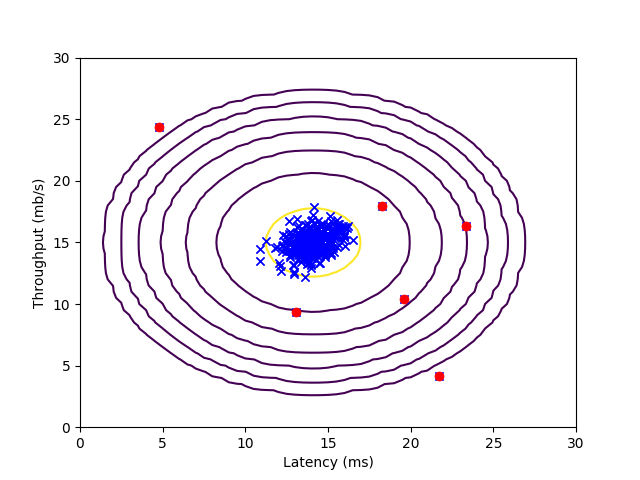

终于到了最后一周接下来就是学习深度学习相关内容,一个是吴恩达老师的深度学习课程,他的深度学习前面一些内容学过机器学习就不需要看了.然后还可以看斯坦福大学的`UFLDL`教程,也有翻译中文版.

<!--more-->

# ex8.py


```python
from numpy.core import *
from scipy.io import loadmat
from imageio import imread
from sklearn import svm
import matplotlib.pyplot as plt
from fucs8 import estimateGaussian, multivariateGaussian, visualizeFit, selectThreshold
if __name__ == "__main__":
    # Machine Learning Online Class
    #  Exercise 8 | Anomaly Detection and Collaborative Filtering
    #
    #  Instructions
    #  ------------
    #
    #  This file contains code that helps you get started on the
    #  exercise. You will need to complete the following functions:
    #
    #     estimateGaussian.m
    #     selectThreshold.m
    #     cofiCostFunc.m
    #
    #  For this exercise, you will not need to change any code in this file,
    #  or any other files other than those mentioned above.
    #

    # ================== Part 1: Load Example Dataset  ===================
    #  We start this exercise by using a small dataset that is easy to
    #  visualize.
    #
    #  Our example case consists of 2 network server statistics across
    #  several machines: the latency and throughput of each machine.
    #  This exercise will help us find possibly faulty (or very fast) machines.
    #

    print('Visualizing example dataset for outlier detection.\n')

    #  The following command loads the dataset. You should now have the
    #  variables X, Xval, yval in your environment
    data = loadmat('ex8data1.mat')
    X = data['X']

    Xval = data['Xval']
    yval = data['yval']

    #  Visualize the example dataset
    plt.figure()
    plt.plot(X[:, 0], X[:, 1], 'xb')
    plt.axis([0, 30, 0, 30])
    plt.xlabel('Latency (ms)')
    plt.ylabel('Throughput (mb/s)')

    print('Program paused. Press enter to continue.')

    # ================== Part 2: Estimate the dataset statistics ===================
    #  For this exercise, we assume a Gaussian distribution for the dataset.
    #
    #  We first estimate the parameters of our assumed Gaussian distribution,
    #  then compute the probabilities for each of the points and then visualize
    #  both the overall distribution and where each of the points falls in
    #  terms of that distribution.
    #
    print('Visualizing Gaussian fit.\n')

    #  Estimate my and sigma2
    mu, sigma2 = estimateGaussian(X)

    #  Returns the density of the multivariate normal at each data point (row)
    #  of X
    p = multivariateGaussian(X, mu, sigma2)

    #  Visualize the fit
    visualizeFit(X,  mu, sigma2)
    plt.xlabel('Latency (ms)')
    plt.ylabel('Throughput (mb/s)')

    print('Program paused. Press enter to continue.')

    # ================== Part 3: Find Outliers ===================
    #  Now you will find a good epsilon threshold using a cross-validation set
    #  probabilities given the estimated Gaussian distribution
    #

    pval = multivariateGaussian(Xval, mu, sigma2)

    epsilon, F1 = selectThreshold(yval, pval)
    print('Best epsilon found using cross-validation: {}'.format(epsilon))
    print('Best F1 on Cross Validation Set:  {}'.format(F1))
    print('   (you should see a value epsilon of about 8.99e-05)')
    print('   (you should see a Best F1 value of  0.875000)\n')

    #  Find the outliers in the training set and plot the
    outliers = nonzero(p < epsilon)

    #  Draw a red circle around those outliers
    plt.plot(X[outliers, 0], X[outliers, 1], 'ro')

    print('Program paused. Press enter to continue.')

    # ================== Part 4: Multidimensional Outliers ===================
    #  We will now use the code from the previous part and apply it to a
    #  harder problem in which more features describe each datapoint and only
    #  some features indicate whether a point is an outlier.
    #

    #  Loads the second dataset. You should now have the
    #  variables X, Xval, yval in your environment
    data = loadmat('ex8data2.mat')
    X = data['X']

    Xval = data['Xval']
    yval = data['yval']

    #  Apply the same steps to the larger dataset
    mu, sigma2 = estimateGaussian(X)

    #  Training set
    p = multivariateGaussian(X, mu, sigma2)

    #  Cross-validation set
    pval = multivariateGaussian(Xval, mu, sigma2)

    #  Find the best threshold
    epsilon, F1 = selectThreshold(yval, pval)

    print('Best epsilon found using cross-validation: {}'.format(epsilon))
    print('Best F1 on Cross Validation Set:  {}'.format(F1))
    print('   (you should see a value epsilon of about 1.38e-18)')
    print('   (you should see a Best F1 value of 0.615385)')
    print('# Outliers found: {}'.format(sum(p < epsilon)))
    plt.show()

```


## 效果

```sh
Visualizing example dataset for outlier detection.

Program paused. Press enter to continue.
Visualizing Gaussian fit.

Program paused. Press enter to continue.
/media/zqh/程序与工程/Python_study/Machine_learning/machine_learning_exam/week8/fucs8.py:113: RuntimeWarning: invalid value encountered in long_scalars
  prec = tp / (tp + fp)
Best epsilon found using cross-validation: 8.990852779269495e-05
Best F1 on Cross Validation Set:  0.8750000000000001
   (you should see a value epsilon of about 8.99e-05)
   (you should see a Best F1 value of  0.875000)

Program paused. Press enter to continue.
Best epsilon found using cross-validation: 1.377228890761358e-18
Best F1 on Cross Validation Set:  0.6153846153846154
   (you should see a value epsilon of about 1.38e-18)
   (you should see a Best F1 value of 0.615385)
# Outliers found: 117
```



# ex8_cofi.py


```python
import matplotlib.pyplot as plt
from numpy.core import *
from scipy.io import loadmat
from numpy import c_, r_
from numpy.random import randn
from scipy.optimize import fmin_cg
from fucs8 import cofiCostFunc, checkCostFunction, loadMovieList, normalizeRatings
if __name__ == "__main__":
    # Machine Learning Online Class
    #  Exercise 8 | Anomaly Detection and Collaborative Filtering
    #
    #  Instructions
    #  ------------
    #
    #  This file contains code that helps you get started on the
    #  exercise. You will need to complete the following functions:
    #
    #     estimateGaussian.m
    #     selectThreshold.m
    #     cofiCostFunc.m
    #
    #  For this exercise, you will not need to change any code in this file,
    #  or any other files other than those mentioned above.
    #

    # =============== Part 1: Loading movie ratings dataset ================
    #  You will start by loading the movie ratings dataset to understand the
    #  structure of the data.
    #
    print('Loading movie ratings dataset.\n')

    #  Load data
    data = loadmat('ex8_movies.mat')
    Y = data['Y']
    R = data['R']
    #  Y is a 1682x943 matrix, containing ratings (1-5) of 1682 movies on
    #  943 users
    #
    #  R is a 1682x943 matrix, where R(i,j) = 1 if and only if user j gave a
    #  rating to movie i

    #  From the matrix, we can compute statistics like average rating.
    print('Average rating for movie 1 (Toy Story): {} / 5'.format(
        mean(Y[0, nonzero(R[0, :])])))

    #  We can "visualize" the ratings matrix by plotting it with imagesc

    plt.imshow(Y)
    plt.ylabel('Movies')
    plt.xlabel('Users')

    print('\nProgram paused. Press enter to continue.')

    # ============ Part 2: Collaborative Filtering Cost Function ===========
    #  You will now implement the cost function for collaborative filtering.
    #  To help you debug your cost function, we have included set of weights
    #  that we trained on that. Specifically, you should complete the code in
    #  cofiCostFunc.m to return J.

    #  Load pre-trained weights (X, Theta, num_users, num_movies, num_features)
    data = loadmat('ex8_movieParams.mat')
    X = data['X']
    Theta = data['Theta']
    num_users = data['num_users']
    num_movies = data['num_movies']
    num_features = data['num_features']

    #  Reduce the data set size so that this runs faster
    num_users = 4
    num_movies = 5
    num_features = 3
    X = X[: num_movies, : num_features]
    Theta = Theta[: num_users, : num_features]
    Y = Y[: num_movies, : num_users]
    R = R[: num_movies, : num_users]

    #  Evaluate cost function
    J, _ = cofiCostFunc(r_[X.ravel(), Theta.ravel()], Y, R,
                        num_users, num_movies, num_features, 0)

    print('Cost at loaded parameters: {}\n(this value should be about 22.22)'.format(J))

    print('Program paused. Press enter to continue.')

    # ============== Part 3: Collaborative Filtering Gradient ==============
    #  Once your cost function matches up with ours, you should now implement
    #  the collaborative filtering gradient function. Specifically, you should
    #  complete the code in cofiCostFunc.m to return the grad argument.
    #
    print('\nChecking Gradients (without regularization) ... ')

    #  Check gradients by running checkNNGradients
    checkCostFunction()

    print('\nProgram paused. Press enter to continue.')

    # ========= Part 4: Collaborative Filtering Cost Regularization ========
    #  Now, you should implement regularization for the cost function for
    #  collaborative filtering. You can implement it by adding the cost of
    #  regularization to the original cost computation.
    #

    #  Evaluate cost function
    J, _ = cofiCostFunc(r_[X.ravel(), Theta.ravel()], Y, R, num_users, num_movies,
                        num_features, 1.5)

    print('Cost at loaded parameters (lambda = 1.5): {} \
           \n(this value should be about 31.34)'.format(J))

    print('\nProgram paused. Press enter to continue.')

    # ======= Part 5: Collaborative Filtering Gradient Regularization ======
    #  Once your cost matches up with ours, you should proceed to implement
    #  regularization for the gradient.
    #

    #
    print('\nChecking Gradients (with regularization) ... ')

    #  Check gradients by running checkNNGradients
    checkCostFunction(1.5)

    print('\nProgram paused. Press enter to continue.')

    # ============== Part 6: Entering ratings for a new user ===============
    #  Before we will train the collaborative filtering model, we will first
    #  add ratings that correspond to a new user that we just observed. This
    #  part of the code will also allow you to put in your own ratings for the
    #  movies in our dataset!
    #
    movieList = loadMovieList()

    #  Initialize my ratings
    my_ratings = zeros((1682, ))

    # Check the file movie_idx.txt for id of each movie in our dataset
    # For example, Toy Story (1995) has ID 1, so to rate it "4", you can set
    my_ratings[0] = 4

    # Or suppose did not enjoy Silence of the Lambs [1991], you can set
    my_ratings[97] = 2

    # We have selected a few movies we liked / did not like and the ratings we
    # gave are as follows:
    my_ratings[6] = 3
    my_ratings[11] = 5
    my_ratings[53] = 4
    my_ratings[63] = 5
    my_ratings[65] = 3
    my_ratings[68] = 5
    my_ratings[182] = 4
    my_ratings[225] = 5
    my_ratings[354] = 5

    print('\nNew user ratings:')
    for i in range(len(my_ratings)):
        if my_ratings[i] > 0:
            print('Rated {} for {}'.format(my_ratings[i], movieList[i]))

    print('\nProgram paused. Press enter to continue.')

    # ================== Part 7: Learning Movie Ratings ====================
    #  Now, you will train the collaborative filtering model on a movie rating
    #  dataset of 1682 movies and 943 users
    #

    print('\nTraining collaborative filtering...')

    #  Load data
    data = loadmat('ex8_movies.mat')
    Y = data['Y']
    R = data['R']

    #  Y is a 1682x943 matrix, containing ratings (1-5) of 1682 movies by
    #  943 users
    #
    #  R is a 1682x943 matrix, where R(i,j) = 1 if and only if user j gave a
    #  rating to movie i

    #  Add our own ratings to the data matrix
    Y = c_[my_ratings, Y]
    R = c_[(my_ratings != 0)+0, R]

    #  Normalize Ratings
    Ynorm, Ymean = normalizeRatings(Y, R)

    #  Useful Values
    num_users = size(Y, 1)
    num_movies = size(Y, 0)
    num_features = 10

    # Set Initial Parameters (Theta, X)
    X = randn(num_movies, num_features)
    Theta = randn(num_users, num_features)

    initial_parameters = r_[X.ravel(), Theta.ravel()]

    # Set options for fmincg
    MaxIter = 50

    # Set Regularization
    lamda = 10

    def costFuc(x): return cofiCostFunc(x, Ynorm, R, num_users, num_movies,
                                        num_features, lamda)[0]

    def gradFuc(x): return cofiCostFunc(x, Ynorm, R, num_users, num_movies,
                                        num_features, lamda)[1]

    theta = fmin_cg(costFuc, initial_parameters, gradFuc, maxiter=MaxIter)

    # Unfold the returned theta back into U and W
    X = reshape(theta[: num_movies*num_features], (num_movies, num_features))
    Theta = reshape(theta[num_movies*num_features:], (num_users, num_features))

    print('Recommender system learning completed.')

    print('\nProgram paused. Press enter to continue.')

    # ================== Part 8: Recommendation for you ====================
    #  After training the model, you can now make recommendations by computing
    #  the predictions matrix.
    #

    p = X @ Theta.T
    my_predictions = p[:, 0] + Ymean.ravel()

    movieList = loadMovieList()

    ix = argsort(my_predictions)[::-1]
    r = sort(my_predictions)[::-1]
    print('\nTop recommendations for you:')
    for i in range(10):
        j = ix[i]
        print('Predicting rating {:.1f} for movie {} '.format(my_predictions[j],
                                                              movieList[j]))

    print('\nOriginal ratings provided:')
    for i in range(len(my_ratings)):
        if my_ratings[i] > 0:
            print('Rated {} for {}'.format(my_ratings[i],
                                           movieList[i]))
    plt.show()

```


## 效果
```sh
Loading movie ratings dataset.

Average rating for movie 1 (Toy Story): 3.8783185840707963 / 5

Program paused. Press enter to continue.
Cost at loaded parameters: 22.22460372568567
(this value should be about 22.22)
Program paused. Press enter to continue.

Checking Gradients (without regularization) ...
[  1.43203539  -0.63274492  -1.00531856   0.89769276  -0.28926118
  -0.65993552  10.17121834  10.43486571 -12.40615625   0.35938134
  -0.02758239  -0.38856257  -5.66399174 -10.80568736  18.42971531
  -3.17534552   1.28489352  10.89656357  -0.23222024  -0.66648527
   0.9995297   -0.0185099    0.65721699   0.33866012   0.
   0.           0.        ] [  1.43203539  -0.63274492  -1.00531856   0.89769276  -0.28926118
  -0.65993552  10.17121834  10.43486571 -12.40615625   0.35938134
  -0.02758239  -0.38856257  -5.66399174 -10.80568736  18.42971531
  -3.17534552   1.28489352  10.89656357  -0.23222024  -0.66648527
   0.9995297   -0.0185099    0.65721699   0.33866012   0.
   0.           0.        ]
The above two columns you get should be very similar.
(Left-Your Numerical Gradient, Right-Analytical Gradient)

If your cost function implementation is correct, then
the relative difference will be small (less than 1e-9).

Relative Difference: 1.3943940851783395e-12


Program paused. Press enter to continue.
Cost at loaded parameters (lambda = 1.5): 31.344056244274213
(this value should be about 31.34)

Program paused. Press enter to continue.

Checking Gradients (with regularization) ...
[-0.3960421  -3.42481695 -0.52898699  0.05550482  1.45849918 -1.46259522
  2.19529571  2.05102836  0.22049044  0.37247193  1.01557475 -5.3171257
 -2.28357796 -1.12923924  1.67314559 -1.21504222 -0.7500923  -2.03542911
 -0.24564074  1.62362884 -4.8857543   1.13231058 -0.71201535 -1.5937657
  2.36345388  3.61334864  1.43292096] [-0.3960421  -3.42481695 -0.52898699  0.05550482  1.45849918 -1.46259522
  2.19529571  2.05102836  0.22049044  0.37247193  1.01557475 -5.3171257
 -2.28357796 -1.12923924  1.67314559 -1.21504222 -0.7500923  -2.03542911
 -0.24564074  1.62362884 -4.8857543   1.13231058 -0.71201535 -1.5937657
  2.36345388  3.61334864  1.43292096]
The above two columns you get should be very similar.
(Left-Your Numerical Gradient, Right-Analytical Gradient)

If your cost function implementation is correct, then
the relative difference will be small (less than 1e-9).

Relative Difference: 2.3144279833807326e-12


Program paused. Press enter to continue.

New user ratings:
Rated 4.0 for Toy Story (1995)
Rated 3.0 for Twelve Monkeys (1995)
Rated 5.0 for Usual Suspects, The (1995)
Rated 4.0 for Outbreak (1995)
Rated 5.0 for Shawshank Redemption, The (1994)
Rated 3.0 for While You Were Sleeping (1995)
Rated 5.0 for Forrest Gump (1994)
Rated 2.0 for Silence of the Lambs, The (1991)
Rated 4.0 for Alien (1979)
Rated 5.0 for Die Hard 2 (1990)
Rated 5.0 for Sphere (1998)

Program paused. Press enter to continue.

Training collaborative filtering...
Warning: Maximum number of iterations has been exceeded.
         Current function value: 38967.455063
         Iterations: 50
         Function evaluations: 85
         Gradient evaluations: 85
Recommender system learning completed.

Program paused. Press enter to continue.

Top recommendations for you:
Predicting rating 5.0 for movie Entertaining Angels: The Dorothy Day Story (1996)
Predicting rating 5.0 for movie Santa with Muscles (1996)
Predicting rating 5.0 for movie Someone Else's America (1995)
Predicting rating 5.0 for movie Prefontaine (1997)
Predicting rating 5.0 for movie Marlene Dietrich: Shadow and Light (1996)
Predicting rating 5.0 for movie They Made Me a Criminal (1939)
Predicting rating 5.0 for movie Great Day in Harlem, A (1994)
Predicting rating 5.0 for movie Saint of Fort Washington, The (1993)
Predicting rating 5.0 for movie Star Kid (1997)
Predicting rating 5.0 for movie Aiqing wansui (1994)

Original ratings provided:
Rated 4.0 for Toy Story (1995)
Rated 3.0 for Twelve Monkeys (1995)
Rated 5.0 for Usual Suspects, The (1995)
Rated 4.0 for Outbreak (1995)
Rated 5.0 for Shawshank Redemption, The (1994)
Rated 3.0 for While You Were Sleeping (1995)
Rated 5.0 for Forrest Gump (1994)
Rated 2.0 for Silence of the Lambs, The (1991)
Rated 4.0 for Alien (1979)
Rated 5.0 for Die Hard 2 (1990)
Rated 5.0 for Sphere (1998)
```


# fucs8.py


```python
import matplotlib.pyplot as plt
from numpy import diag, linspace, meshgrid, c_, r_, isinf
from numpy.random import rand, randn
from numpy.core import *
from numpy.linalg import det, pinv, norm
from numpy.matrixlib import mat


def estimateGaussian(X: ndarray):
    # ESTIMATEGAUSSIAN This function estimates the parameters of a
    # Gaussian distribution using the data in X
    #   [mu sigma2] = estimateGaussian(X),
    #   The input X is the dataset with each n-dimensional data point in one row
    #   The output is an n-dimensional vector mu, the mean of the data set
    #   and the variances sigma^2, an n x 1 vector
    #

    # Useful variables
    m, n = shape(X)

    # You should return these values correctly
    mu = zeros((n, 0))
    sigma2 = zeros((n, 0))

    # ====================== YOUR CODE HERE ======================
    # Instructions: Compute the mean of the data and the variances
    #               In particular, mu(i) should contain the mean of
    #               the data for the i-th feature and sigma2(i)
    #               should contain variance of the i-th feature.
    #

    mu = mean(X, 0)
    sigma2 = 1/m * sum((X-mu.reshape(1, -1))**2, 0)

    # =============================================================

    return mu, sigma2


def multivariateGaussian(X: ndarray, mu: ndarray, Sigma2: ndarray):
    # MULTIVARIATEGAUSSIAN Computes the probability density function of the
    # multivariate gaussian distribution.
    #    p = MULTIVARIATEGAUSSIAN(X, mu, Sigma2) Computes the probability
    #    density function of the examples X under the multivariate gaussian
    #    distribution with parameters mu and Sigma2. If Sigma2 is a matrix, it is
    #    treated as the covariance matrix. If Sigma2 is a vector, it is treated
    #    as the \sigma^2 values of the variances in each dimension (a diagonal
    #    covariance matrix)
    #

    k = len(mu)

    if (size(mat(Sigma2), 1) == 1) or (size(mat(Sigma2), 0) == 1):
        Sigma2 = diag(Sigma2)

    x = X - mu.reshape(1, -1)

    p = (2 * pi)**(- k / 2) * det(Sigma2) ** (-0.5) * \
        exp(-0.5 * sum(x@pinv(Sigma2)*x, 1))

    return p


def visualizeFit(X, mu, sigma2):
    # VISUALIZEFIT Visualize the dataset and its estimated distribution.
    #   VISUALIZEFIT(X, p, mu, sigma2) This visualization shows you the
    #   probability density function of the Gaussian distribution. Each example
    #   has a location (x1, x2) that depends on its feature values.
    #

    X1, X2 = meshgrid(arange(0, 35.5, .5), arange(0, 35.5, .5))  # type:ndarray
    Z = multivariateGaussian(c_[X1.ravel(), X2.ravel()], mu, sigma2)
    Z = reshape(Z, shape(X1))

    plt.plot(X[:, 0], X[:, 1], 'bx')
    # Do not plot if there are infinities
    # map(lamda x: 10**x, range(-20, 0, 3))
    if (sum(isinf(Z)) == 0):
        plt.contour(X1, X2, Z, list(map(lambda x: 10**x, range(-20, 0, 3))))


def selectThreshold(yval: ndarray, pval: ndarray):
    # SELECTTHRESHOLD Find the best threshold (epsilon) to use for selecting
    # outliers
    #   [bestEpsilon bestF1] = SELECTTHRESHOLD(yval, pval) finds the best
    #   threshold to use for selecting outliers based on the results from a
    #   validation set (pval) and the ground truth (yval).
    #

    bestEpsilon = 0
    bestF1 = 0
    F1 = 0

    stepsize = (max(pval) - min(pval)) / 1000
    for epsilon in arange(min(pval), max(pval), stepsize):

        # ====================== YOUR CODE HERE ======================
        # Instructions: Compute the F1 score of choosing epsilon as the
        #               threshold and place the value in F1. The code at the
        #               end of the loop will compare the F1 score for this
        #               choice of epsilon and set it to be the best epsilon if
        #               it is better than the current choice of epsilon.
        #
        # Note: You can use predictions = (pval < epsilon) to get a binary vector
        #       of 0's and 1's of the outlier predictions

        predictions = (pval < epsilon)

        fp = sum((predictions == 1) & (yval.ravel() == 0))
        fn = sum((predictions == 0) & (yval.ravel() == 1))
        tp = sum((predictions == 1) & (yval.ravel() == 1))

        prec = tp / (tp + fp)
        rec = tp / (tp + fn)

        F1 = 2 * prec * rec / (prec + rec)

        # =============================================================

        if F1 > bestF1:
            bestF1 = F1
            bestEpsilon = epsilon

    return bestEpsilon, bestF1


def cofiCostFunc(params, Y, R, num_users, num_movies, num_features, lamda):
    # COFICOSTFUNC Collaborative filtering cost function
    #   [J, grad] = COFICOSTFUNC(params, Y, R, num_users, num_movies, ...
    #   num_features, lamda) returns the cost and gradient for the
    #   collaborative filtering problem.
    #

    # Unfold the U and W matrices from params
    X = reshape(params[: num_movies*num_features],
                (num_movies, num_features))  # type:ndarray
    Theta = reshape(params[num_movies*num_features:],
                    (num_users, num_features))  # type:ndarray

    # You need to return the following values correctly
    J = 0
    X_grad = zeros(shape(X))
    Theta_grad = zeros(shape(Theta))

    # ====================== YOUR CODE HERE ======================
    # Instructions: Compute the cost function and gradient for collaborative
    #               filtering. Concretely, you should first implement the cost
    #               function (without regularization) and make sure it is
    #               matches our costs. After that, you should implement the
    #               gradient and use the checkCostFunction routine to check
    #               that the gradient is correct. Finally, you should implement
    #               regularization.
    #
    # Notes: X - num_movies  x num_features matrix of movie features
    #        Theta - num_users  x num_features matrix of user features
    #        Y - num_movies x num_users matrix of user ratings of movies
    #        R - num_movies x num_users matrix, where R(i, j) = 1 if the
    #            i-th movie was rated by the j-th user
    #
    # You should set the following variables correctly:
    #
    #        X_grad - num_movies x num_features matrix, containing the
    #                 partial derivatives w.r.t. to each element of X
    #        Theta_grad - num_users x num_features matrix, containing the
    #                     partial derivatives w.r.t. to each element of Theta
    #
    J_temp = (X @ Theta.T - Y) ** 2
    J = sum(J_temp[nonzero(R == 1)])/2 + lamda/2 * \
        sum(Theta ** 2) + lamda/2 * sum(X ** 2)

    X_grad = ((X@Theta.T - Y) * R) @ Theta + lamda*X
    Theta_grad = ((X@Theta.T - Y) * R).T @ X + lamda*Theta

    # =============================================================

    grad = r_[X_grad.ravel(), Theta_grad.ravel()]

    return J, grad


def computeNumericalGradient(J, theta: ndarray):
    # COMPUTENUMERICALGRADIENT Computes the gradient using "finite differences"
    # and gives us a numerical estimate of the gradient.
    #   numgrad = COMPUTENUMERICALGRADIENT(J, theta) computes the numerical
    #   gradient of the function J around theta. Calling y = J(theta) should
    #   return the function value at theta.

    # Notes: The following code implements numerical gradient checking, and
    #        returns the numerical gradient.It sets numgrad(i) to (a numerical
    #        approximation of) the partial derivative of J with respect to the
    #        i-th input argument, evaluated at theta. (i.e., numgrad(i) should
    #        be the (approximately) the partial derivative of J with respect
    #        to theta(i).)
    #

    numgrad = zeros(shape(theta))
    perturb = zeros(shape(theta))
    e = 1e-4
    for p in range(size(theta)):
        # Set perturbation vector
        perturb[p] = e
        loss1 = J(theta - perturb)[0]
        loss2 = J(theta + perturb)[0]
        # Compute Numerical Gradient
        numgrad[p] = (loss2 - loss1) / (2*e)
        perturb[p] = 0
    return numgrad


def checkCostFunction(lamda=0):
    # CHECKCOSTFUNCTION Creates a collaborative filering problem
    # to check your cost function and gradients
    #   CHECKCOSTFUNCTION(lamda) Creates a collaborative filering problem
    #   to check your cost function and gradients, it will output the
    #   analytical gradients produced by your code and the numerical gradients
    #   (computed using computeNumericalGradient). These two gradient
    #   computations should result in very similar values.

    # Create small problem
    X_t = rand(4, 3)
    Theta_t = rand(5, 3)

    # Zap out most entries
    Y = X_t @ Theta_t.T
    Y[nonzero(rand(size(Y, 0), size(Y, 1)) > 0.5)] = 0
    R = zeros(shape(Y))
    R[nonzero(Y != 0)] = 1

    # Run Gradient Checking
    X = randn(size(X_t))
    Theta = randn(size(Theta_t))
    num_users = size(Y, 1)
    num_movies = size(Y, 0)
    num_features = size(Theta_t, 1)

    def Costfunc(x): return cofiCostFunc(
        x, Y, R, num_users, num_movies, num_features, lamda)

    numgrad = computeNumericalGradient(Costfunc, r_[X.ravel(), Theta.ravel()])

    cost, grad = cofiCostFunc(r_[X.ravel(), Theta.ravel()],  Y, R, num_users, num_movies,
                              num_features, lamda)

    print(numgrad, grad)
    print('The above two columns you get should be very similar.\n\
(Left-Your Numerical Gradient, Right-Analytical Gradient)\n')

    diff = norm(numgrad-grad)/norm(numgrad+grad)
    print('If your cost function implementation is correct, then \n\
the relative difference will be small (less than 1e-9). \n\
\nRelative Difference: {}\n'.format(diff))


def loadMovieList():
    # GETMOVIELIST reads the fixed movie list in movie.txt and returns a
    # cell array of the words
    #   movieList = GETMOVIELIST() reads the fixed movie list in movie.txt
    # and returns a cell array of the words in movieList.

    # Store all movies in cell array movie{}
    n = 1682
    movieList = []
    with open('movie_ids.txt') as fid:
        for line in fid:
            movieList.append(line.strip().split(' ', maxsplit=1)[1])

    return movieList


def normalizeRatings(Y: ndarray, R: ndarray):
    # NORMALIZERATINGS Preprocess data by subtracting mean rating for every
    # movie (every row)
    #   [Ynorm, Ymean] = NORMALIZERATINGS(Y, R) normalized Y so that each movie
    #   has a rating of 0 on average, and returns the mean rating in Ymean.
    #

    m, n = shape(Y)
    Ymean = zeros((m, 1))
    Ynorm = zeros(shape(Y))
    for i in range(m):
        idx = nonzero(R[i, :] == 1)
        Ymean[i, :] = mean(Y[i, idx])
        Ynorm[i, idx] = Y[i, idx] - Ymean[i]

    return Ynorm, Ymean

```

