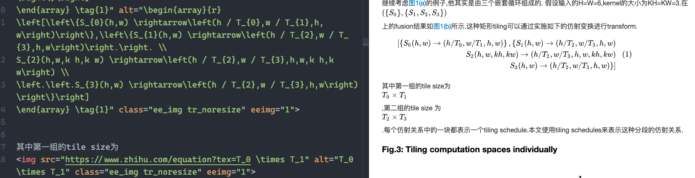

我最近想把写的东西弄到知乎上,但是发现一堆问题,按照之前的方式出现了老多错误,因此记录一下.

<!--more-->

1. 公式导入

按照[markdown4zhihu](https://zhuanlan.zhihu.com/p/97455277)的方案,我本地把公式处理成知乎可以预览的模式之后, 本地显示如下:



然后导入知乎后,全部变成空白了:


然后我各种尝试才发现现在知乎可以直接接受`$$.*$$`的导入,但是不接受`$.*$`的导入, 因此修改代码如下:
```python
def formula_ops(_lines):
  # _lines = re.sub(r'\$\$\n*([\s\S]*?)\n*\$\$',
  #                 r'\n\n', _lines)
  _lines = re.sub(r'\$(.+?)\$',
                  r'$$\1$$', _lines)
  return _lines
```

2. 标注导入

问了客服, 知乎暂时还不支持标注的导入, 而且手写起来特别麻烦, 简直吐血.